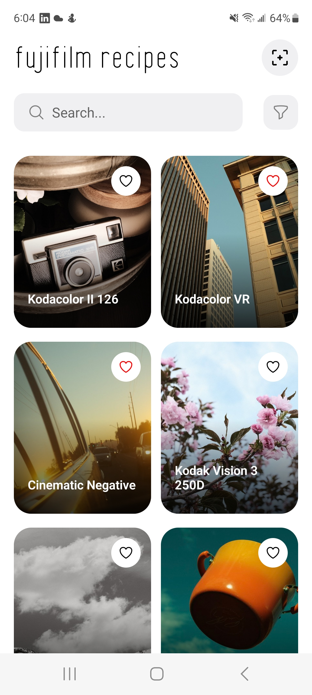
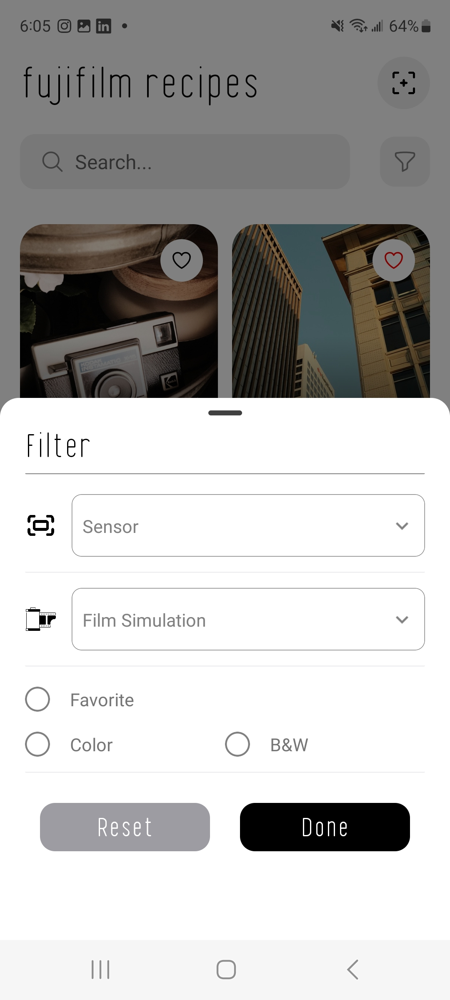
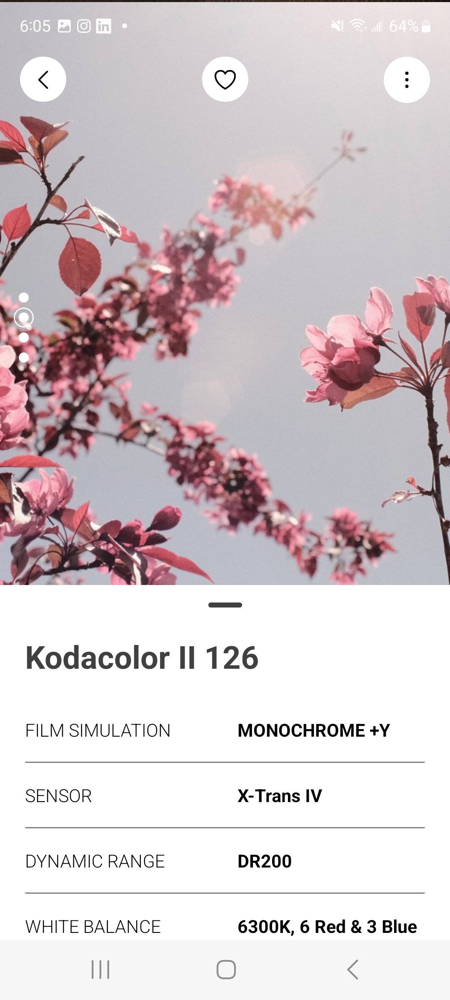
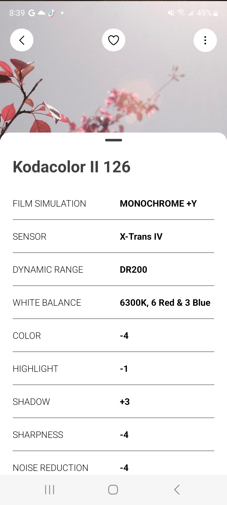
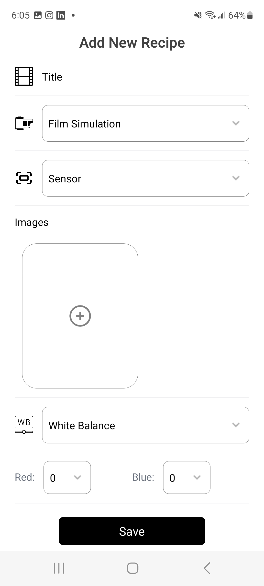
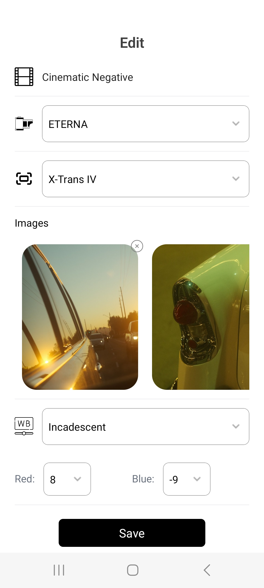

# Fujifilm Recipe App

This is a React Native app to store Fujifilm film presets for Fujifilm camera's photoholic.

Recipes are inspired from [FujiXWeekly](https://fujixweekly.com/)

Additional features:

- [Firebase](https://firebase.google.com/) to store recipes data using Cloud Firestore and Storage
- [Formik](https://formik.org/docs/overview) & [Yup](https://github.com/jquense/yup) for form validation
- [TailwindCSS](https://tailwindcss.com/docs/installation) for UI implementation
- [Reanimated](https://reanimated-beta-docs.swmansion.com/) 2 for animations
- [Bottom Sheet](https://gorhom.github.io/react-native-bottom-sheet/)
- Modal with Animations and Blurred Background

## Screenshots

## Demo

## APKs

You can find the apk to install [here](https://drive.google.com/file/d/1eXdn0PtaVj31duOeJw96z6yB2Oss7iRU/view?usp=sharing)
